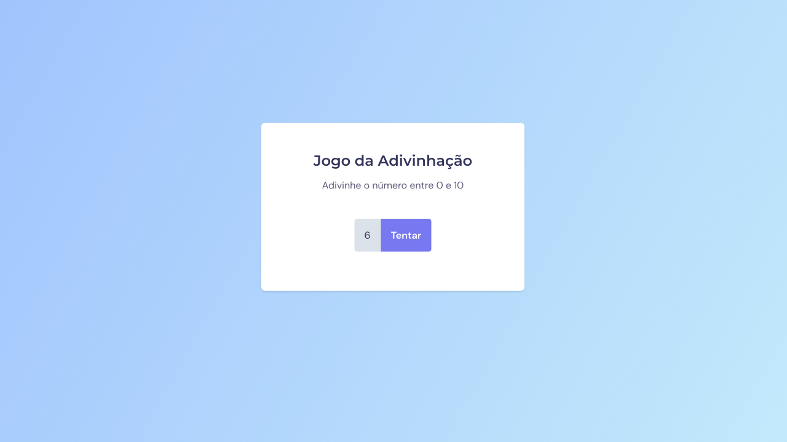

<h1 align="center"> Jogo da advinhação </h1>

Projeto desenvolvido no curso Explorer da Rocketseat.

  <a href="#-tecnologias">Tecnologias</a>&nbsp;&nbsp;&nbsp;|&nbsp;&nbsp;&nbsp;
  <a href="#-projeto">Projeto</a>&nbsp;&nbsp;&nbsp;|&nbsp;&nbsp;&nbsp;
  <a href="#-layout">Layout</a>&nbsp;&nbsp;&nbsp;|&nbsp;&nbsp;&nbsp;

  

## 🚀 Tecnologias

Esse projeto foi desenvolvido com as seguintes tecnologias:

- HTML
- CSS
- JavaScript
 

## 💻 Projeto

O jogo de advinhação é um jogo que você seleciona números de 0 a 10 até acertar o número.  
Aprendi a manipular a DOM com esse projeto, a parte mais desafiadora foi fazer as animações que não foram pedidas meu eu acrescentei por conta própria.
 

## 🔖 Layout

Você pode visualizar o layout do projeto através [DESSE LINK](https://www.figma.com/file/vdTrB9raYTEBiTjziDwQlc/Jogo-Adivinha%C3%A7%C3%A3o-(Copy)?node-id=0%3A1). É necessário ter conta no [Figma](https://figma.com) para acessá-lo.
